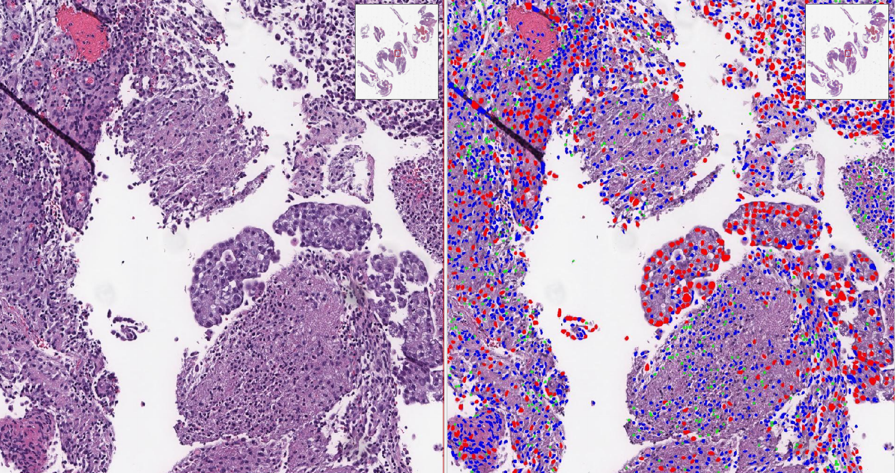

# CellularArchitecture
Investigating WSI Cellular Architecture to Decipher Tumor Heterogeneity - [Models for nuclei sementationa and classification](https://www.synapse.org/#!Synapse:syn50619016).



## Environment Configurations
### a. Prepare docker image
* Build from Dockerfile
```
$ docker build -t cellular_architecture:chen .
```
* Or pull from Docker Hub
```
$ docker pull pingjunchen/cellular_architecture:chen
$ docker tag pingjunchen/cellular_architecture:chen cellular_architecture:chen
```

### b. Setup docker container
* Start docker container (specify CODE_ROOT & DATA_ROOT)
```
$ docker run -it --rm --user $(id -u):$(id -g) \
  -v ${CODE_ROOT}:/App/CellularArchitecture \
  -v ${DATA_ROOT}:/Data \
  --shm-size=224G --gpus '"device=0,1"' --cpuset-cpus=0-39 \
  --name cellular_architecture_chen cellular_architecture:chen
```
* For example:
```
$ docker run -it --rm --user $(id -u):$(id -g) \
  -v /rsrch1/ip/pchen6/Codes/CHEN/CellularArchitecture:/App/CellularArchitecture \
  -v /rsrch1/ip/pchen6/CellularArchitectureData:/Data \
  --shm-size=768G --gpus '"device=2,3,4,5,6,7"' --cpuset-cpus=100-255 \
  --name cellular_architecture_chen cellular_architecture:chen
```

## WSI Cellular Architecture Study
### 1. PreprocessSlides - Extract annotated core tissue regions
### 2. BlockProcess - Block-wise stain normalization and nuclei segmentation
### 3. NucleiAnalysis - Nuclei classification and overlaying
### 4. TumorHeterogeneity - Study the slide heterogeneity 


